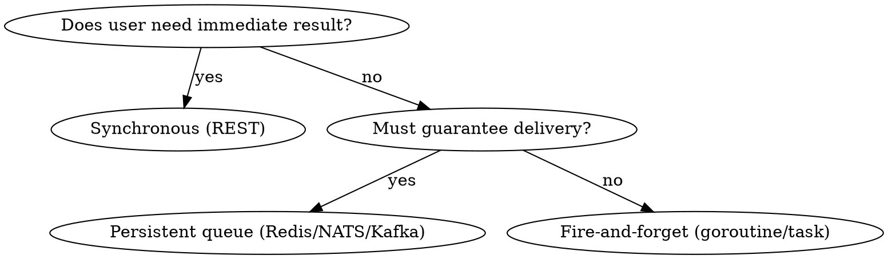

# Event-Driven Architecture

## Overview

Patterns for async processing, background jobs, event publishing, and webhook handling. When synchronous request-response isn't enough.

**Core principle:** Use events for work that doesn't need to block the user's request. Keep the request path fast.

## When to Use

- Sending emails/notifications after an action
- Processing uploads or heavy computation
- Syncing data between services
- Implementing webhooks (incoming and outgoing)
- Real-time updates (WebSocket, SSE)
- Any operation that takes > 500ms and doesn't need synchronous response

## Pattern Decision



## Background Jobs (Simple)

**Go — goroutine with errgroup:**
```go
// Fire-and-forget (non-critical)
go func() {
    if err := emailService.SendWelcome(ctx, user); err != nil {
        slog.Error("failed to send welcome email", "error", err, "user_id", user.ID)
    }
}()

// With graceful shutdown tracking
g, ctx := errgroup.WithContext(ctx)
g.Go(func() error {
    return emailService.SendWelcome(ctx, user)
})
// Don't wait in handler — track in service lifecycle
```

**Python — background tasks (FastAPI):**
```python
from fastapi import BackgroundTasks

@router.post("/users", status_code=201)
async def create_user(
    body: CreateUserRequest,
    background_tasks: BackgroundTasks,
    use_case: CreateUserUseCase = Depends(get_create_user),
) -> UserResponse:
    user = await use_case.execute(body.to_input())
    background_tasks.add_task(send_welcome_email, user.email, user.name)
    return UserResponse.from_domain(user)
```

## Message Queue (Redis Pub/Sub)

**Go — publish:**
```go
type EventPublisher struct {
    rdb *redis.Client
}

func (p *EventPublisher) Publish(ctx context.Context, topic string, event any) error {
    data, err := json.Marshal(event)
    if err != nil {
        return fmt.Errorf("marshal event: %w", err)
    }
    return p.rdb.Publish(ctx, topic, data).Err()
}

// Usage
publisher.Publish(ctx, "user.created", UserCreatedEvent{
    UserID: user.ID,
    Email:  user.Email,
})
```

**Go — subscribe:**
```go
func (s *EventSubscriber) Subscribe(ctx context.Context, topic string, handler func([]byte) error) {
    sub := s.rdb.Subscribe(ctx, topic)
    ch := sub.Channel()

    for msg := range ch {
        if err := handler([]byte(msg.Payload)); err != nil {
            slog.Error("event handler failed", "topic", topic, "error", err)
        }
    }
}
```

**Python — publish/subscribe:**
```python
import redis.asyncio as redis

class EventPublisher:
    def __init__(self, redis_client: redis.Redis) -> None:
        self._redis = redis_client

    async def publish(self, topic: str, event: dict) -> None:
        await self._redis.publish(topic, json.dumps(event))

class EventSubscriber:
    def __init__(self, redis_client: redis.Redis) -> None:
        self._pubsub = redis_client.pubsub()

    async def subscribe(self, topic: str, handler: Callable) -> None:
        await self._pubsub.subscribe(topic)
        async for message in self._pubsub.listen():
            if message["type"] == "message":
                await handler(json.loads(message["data"]))
```

## Webhook Handling (Incoming)

```go
// Receive webhook with signature verification
func (h *WebhookHandler) HandleStripeWebhook(c fiber.Ctx) error {
    body := c.Body()
    sig := c.Get("Stripe-Signature")

    event, err := webhook.ConstructEvent(body, sig, webhookSecret)
    if err != nil {
        return pkg.NewError("unauthorized", "Invalid webhook signature", 401)
    }

    switch event.Type {
    case "payment_intent.succeeded":
        return h.handlePaymentSuccess(c.Context(), event)
    case "customer.subscription.deleted":
        return h.handleSubscriptionCanceled(c.Context(), event)
    default:
        slog.Info("unhandled webhook event", "type", event.Type)
    }

    return c.SendStatus(200)
}
```

**Webhook best practices:**
- Always verify signatures
- Return 200 quickly, process async
- Make handlers idempotent (same event delivered twice = same result)
- Log unhandled event types (don't error on them)
- Store raw event for replay/debugging

## Webhook Sending (Outgoing)

```go
type WebhookSender struct {
    client *http.Client
}

func (s *WebhookSender) Send(ctx context.Context, url string, event any) error {
    body, _ := json.Marshal(event)

    // Sign payload
    mac := hmac.New(sha256.New, []byte(webhookSecret))
    mac.Write(body)
    signature := hex.EncodeToString(mac.Sum(nil))

    req, _ := http.NewRequestWithContext(ctx, "POST", url, bytes.NewReader(body))
    req.Header.Set("Content-Type", "application/json")
    req.Header.Set("X-Webhook-Signature", signature)

    resp, err := s.client.Do(req)
    if err != nil {
        return fmt.Errorf("webhook delivery failed: %w", err)
    }
    defer resp.Body.Close()

    if resp.StatusCode >= 400 {
        // Retry with exponential backoff
        return fmt.Errorf("webhook returned %d", resp.StatusCode)
    }
    return nil
}
```

## Event Design

```go
// Events are past-tense, immutable facts
type UserCreatedEvent struct {
    EventID   uuid.UUID `json:"event_id"`
    Timestamp time.Time `json:"timestamp"`
    UserID    uuid.UUID `json:"user_id"`
    Email     string    `json:"email"`
}

// Name convention: [entity].[action] in past tense
// user.created, payment.succeeded, invitation.accepted
```

## Common Mistakes

- **Processing in the request path** — send email synchronously, blocking the API response
- **No idempotency** — processing the same event twice creates duplicate records
- **No dead letter handling** — failed events disappear silently
- **No event schema versioning** — breaking consumers when event shape changes
- **Fire-and-forget for critical work** — use persistent queue for anything that must happen

## Chains

- **Architecture:** Decided in `system-design`
- **Implementation:** Use `go-feature` or `py-feature` for the handlers
